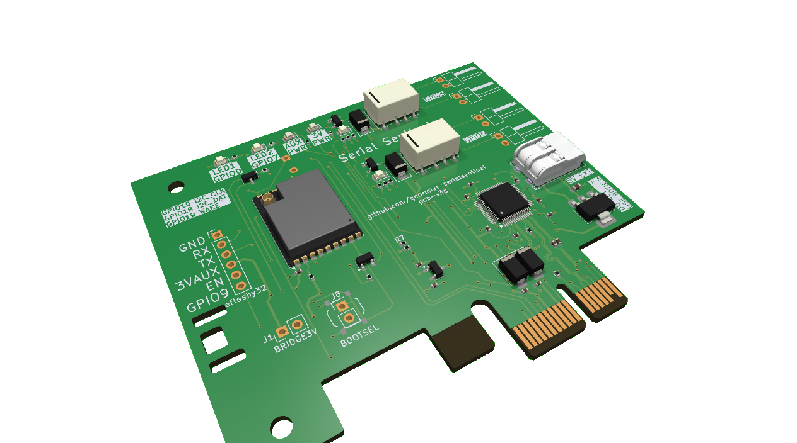

### Early Access - still working on the esphome logic, but the hardware is working and documented.




# Serial Sentinel
Allows you full control of your computer's power button and reset button, remotely. Exposes a serial power that lets you run a watchdog and restart your computer in the event of a lockup. Or, send commands to hard-reset, power on or power off whenever you'd like.

## Specs
In a nutshell,

- PCIe x1 card
  - Low-profile / slim size
  - Should fit in servers, please verify
  - Runs off 3.3VAUX, which keeps powering the device, even when your PC shuts down
- WiFi with external antenna
- 2 serial ports exposed
  - One for esphome serial logging and programming
  - Another for heartbeat communications
  - WCH382L PCIe-Serial bridge (native Linux support, optional Linux driver, requires Windows driver)
- 3.3V voltage monitor
  - Good indicator if the computer is powered on or not
- PCIe wake output
  - Another option to wake up your computer
- Two relays with dual sets of pin headers
  - Intercept and passthrough your PC's power button and reset button
  - "push" either of those buttons remotely
- Two user status LED's
- Two LED's indicating power status of computer
- External 3.3V and 5V input in case you need creative options for "always-on" power supply
  - eg. You could tap the 5VSB from your ATX PSU if your motherboard does not provide 3V3AUX for some reason, or has a weak 3V3AUX rail.
- Optional beeper
- Many solderable jumpers to configure power supply settings in case your motherboard is weird

# Physical Installation
1. Always ensure your computer is fully powere off (eg ATX PSU is off) before installing the card. This card uses the 3.3VAUX rail, which is *always* powered on when the PSU is plugged in.
2. Insert the card into a free PCIe x1 slot.
3. Intercept your power button and/or reset button cables and connect them to the card. You can use any method, but easiest would be to use premade ["DuPont" cables](https://www.amazon.ca/s?k=dupont+connector+female+to+make) of various termination styles and lengths (eg. female-male, female-female).
4. Turn on your power supply.
5. With your computer still "off" (but with the power supply on), ensure you can see a green light on Serial Sentinel. This means you have 3.3VAUX power and can proceed.
    - You *MAY* need to run your computer through 1 valid power-on and power-off sequence to ensure the 3.3VAUX rail activated by your motherboard.
    - If you don't have a green light, you will likely need to source the power from elsewhere.
    - If you have an internal USB header that is "always on", you can use that to power the card using the 5V input.
    - You can also [tap](https://www.amazon.ca/t-tap-wire-connectors/s?k=t+tap+wire+connectors) a 3.3V wire from your [ATX PSU](https://en.wikipedia.org/wiki/ATX#Power_supply), and use it on the card's 3.3V input.
    - Do NOT use both the 5V and 3.3V inputs on the card. Use only 1.

## WiFi Antenna
An external antenna can be attached carefully to the ESP32-C3 using a [u.FL to SMA](https://www.amazon.ca/s?k=u.fl+to+sma+connector) cable. Any standard 2.4GHz SMA antenna will work. You can either use the included cutouts on the PCB to zip tie the antenna, or 3D print a bracket, or use an old/existing bracket and drill a 1/4" (6.35mm) hole to fit the SMA side of the cable connector.


# Software Installation
## Device ID and serial port
First, make sure you can see the device

```
$ lspci | grep CH382
03:00.0 Serial controller: Nanjing Qinheng Microelectronics Co., Ltd. CH352/CH382 PCI/PCIe Dual Port Serial Adapter (rev 10)
```

Find out which serial ports the device has created.
```
$ sudo dmesg | grep ttyS
[    0.496389] serial8250: ttyS1 at I/O 0x2f8 (irq = 3, base_baud = 115200) is a 16550A
[    0.498301] 0000:03:00.0: ttyS4 at I/O 0xd0c0 (irq = 17, base_baud = 115200) is a XR16850
[    0.500166] 0000:03:00.0: ttyS5 at I/O 0xd0c8 (irq = 17, base_baud = 115200) is a XR16850
```

In this case, ttyS4 and ttyS5 are the two serial ports. S4 is the native ESP32 serial port, which would be used for any logging or flashing over serial. S5 is the port you should use as communications for heartbeat and commands/etc based on the code you have running on the ESP32.

## First Flash
Sanity check that esptool can see and talk to the device.

```
$ esptool.py --port /dev/ttyS4 chip_id
esptool.py v4.8.1
Serial port /dev/ttyS4
Connecting....
Detecting chip type... ESP32-C3
Chip is ESP32-C3 (QFN32) (revision v0.4)
Features: WiFi, BLE
Crystal is 40MHz
MAC: b4:3a:45:4c:3f:f4
Uploading stub...
Running stub...
Stub running...
Warning: ESP32-C3 has no Chip ID. Reading MAC instead.
MAC: b4:3a:45:4c:3f:f4
Hard resetting via RTS pin...
```
If you see the above, you are ready to flash the firmware. If you don't see the device, check your serial port and ensure you have the right one.

Recommended baud rate is 115,200 for any flashing over serial.


# Common Questions
## Do I need a smarthome?
Nope. You can use the device without any smarthome integration. It can be used as a standalone device to control your computer's power and reset buttons, and you can program it to do various tasks based on the serial commands it receives.

## Do I need WiFi?
Nope. You can program the device to act on it's own based on the various inputs/conditions. You can do this with esphome, or with the Arduino framework or ESP-IDF. WiFi is only needed if you want to control the device remotely.

## Do I need drivers?
  - Linux will support the WCH382L serial bridge natively, so no drivers are needed. WCH does provide [Linux drivers](https://github.com/WCHSoftGroup/ch35_38x_linux), but they are not needed and seem to cause more trouble than it's worth.
  - Windows will require the WCH382L drivers to be installed. You can find them on the [WCH website](https://www.wch-ic.com/downloads/CH38XDRV_EXE.html). I do not use Windows for this project, so I can't provide assistance.

## Do I need any software?
In theory you don't even need to use the serial ports (other then getting your code to the device). You could just flash esphome, and control the device yourself remotely.
Or you could hardcode some dumb logic to control the power and reset buttons based on the inputs you have available. 

More advanced usage would have you regularly sending
a heartbeat to the device, and the device would then be able to reset your computer if it stops receiving heartbeats.

# Troubleshooting

## Constantly resetting
The circuit has logic that will reset the device via DTR/RTS so that the initial firmware can be loaded with `esptool`.
If your operating system is sending signals, that can cause the device to reset, or remain in a reset state
which would be an unresponsive state. You can try to prevent this with software. Or, after the first flash, you can remove the DTR/RTS jumpers on the PCB to prevent this from happening and keep updating the device over WiFi.